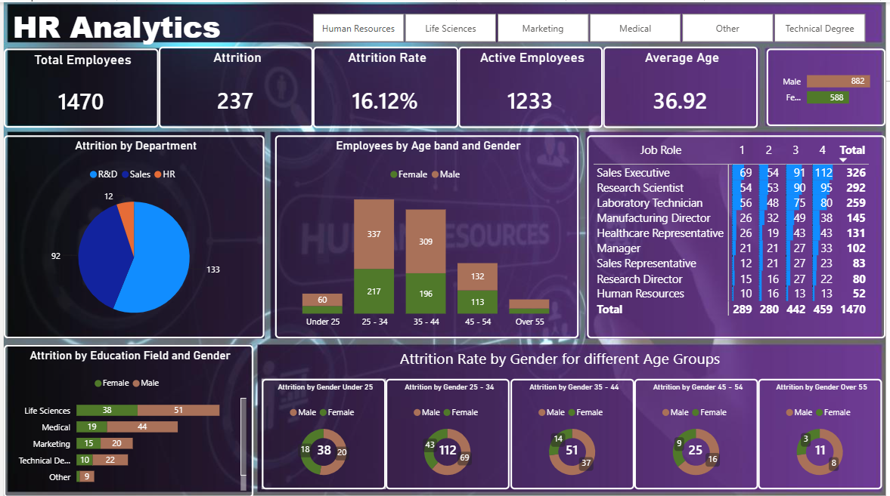

# HR Analytics Dashboard

## Overview

Interactive Power BI dashboard developed during college training to analyze HR-related business data.

## Analysis Covered

- Total headcount
- Attrition rate
- Department-wise analysis
- Job role analysis
- Education field analysis
- Trend analysis
- Interactive slicers and KPI cards

## Tools Used

- Microsoft Power BI
- Data visualization
- Business analytics
- 
## Dashboard Preview

