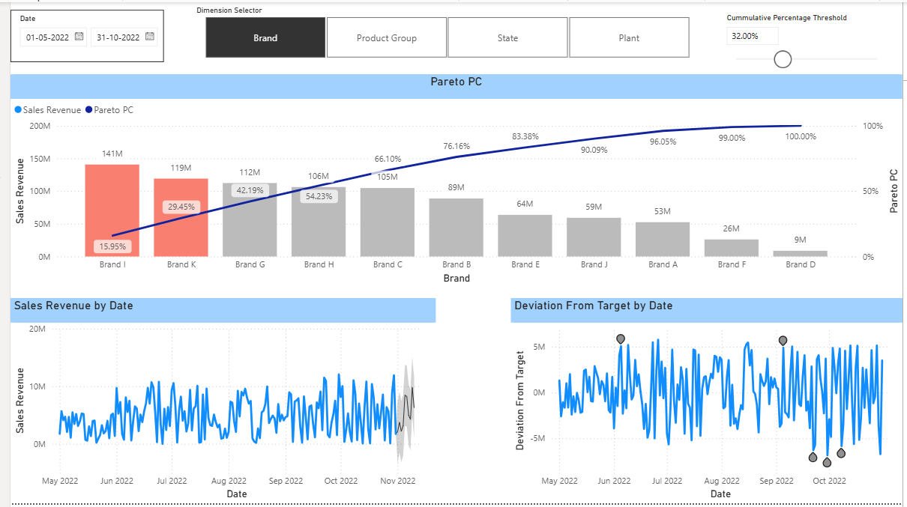

# Retail & Pareto Analytics Dashboard

## Overview

Interactive Power BI dashboard developed during college training to analyze sales revenue, Pareto contribution, and performance against targets.

## Analysis Covered

- Sales revenue analysis
- Pareto analysis and cumulative percentage
- Adjustable cumulative percentage threshold
- Brand-wise analysis
- Product Group analysis
- State-wise analysis
- Plant-wise analysis
- Sales revenue trends by date
- Deviation from target analysis
- Interactive date and dimension filters

## Tools Used

- Microsoft Power BI
- Data visualization
- Business analytics
- Pareto analysis
- Interactive reporting

## Dashboard Preview

